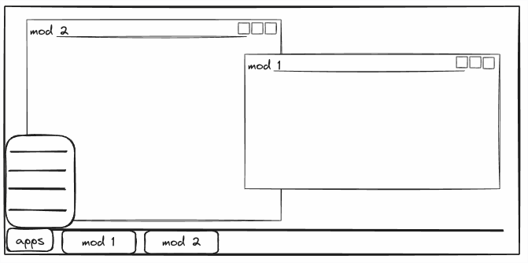
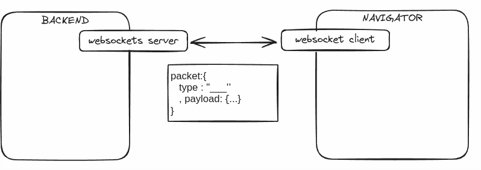
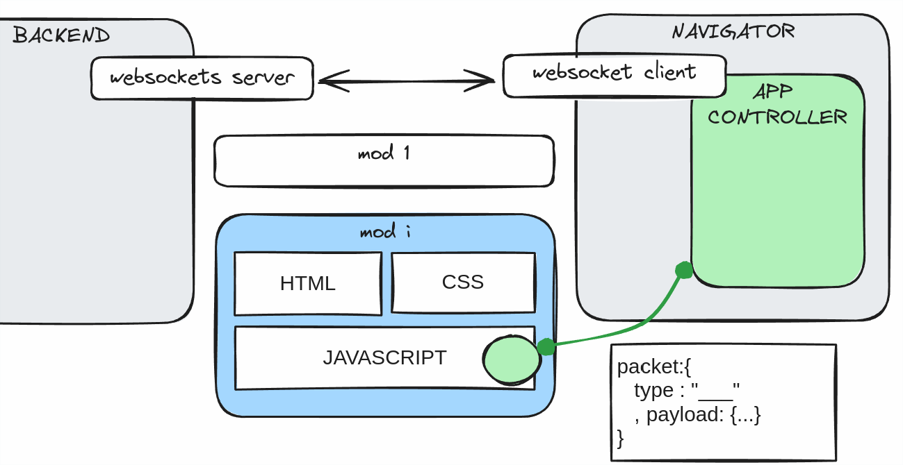

# Coyot3vuapp

## INTRODUCTION:

I am _obviously_ a "backend" developper. Witch means that, I am just not strong to create front-end ergonomic applications. BUT, we are al forced to, at some time, develop some kind of inteface.

In my case, I realized time ago that the most productive way to develop any kind of interface is to benefit of the web technologies and follow the lead of the www... and use the combo html5+css+js.

As I have always been _forced_ to develop fast front-end results, I never (kind'a) have the time to learn to develop mature web applications and benerit of the maturity level of frameworks or libraries such react, angular, vue... and get the culture to know how to use existing components or to develop new ones, in order to create mature and durable project/contents.

What I did learn is to create visually effective "renders", and I met my *common factor* of how I would like to develop my applications, as well as an effective strategy to be able to make it communicate with a backend. I learned to use the benefits of libraries like jQuery, some tricks of the css3, html5, and use some little packets that *the community* shares, and (of course) I fell in love with SocketIO and its event-like communications.

That way I realized that I would be always be able to satisfy the need of any kind of representation by using a Desktop like application, that would contain modules that, like applications, would satisfy some specific need.

However, I need to communicate in a way that does not break my advances in the backend, OR the front-end. Basically, make both of the devs independent. Meaning: When I am working in a c++ project, I want to be able to fully model my frontend FROM the front end side, with no interruptions. I need a front-end as much STANDALONE as possible, to satisfy this schema:

From one side:

* One **backend** that will interact using Json strings. It will distribute messages to "somewhere" using its server (*my `coyot3::services::WebsocketsServerGateway`, that wraps me the use of `libwebsockets`*), that would also serve whatever http contents. the **backend** will also react to the send of the front-end packets, using the strategy of socket-io: basically, sending a packet typed by a string, containing any kind of payload.
* And the **front-end**. Needing to develop different types of views, always growing... needed to be maintained separated from the repositories of the backend to eventually, make them evolve, using the strategy of "*components*", where a "component" is a lightweight code dedicated to "render" some content focusing directly in javascript, html and css.

Anyways, I am aware of the benefits of using react... or angular... so I tried to build me some kind of standalone front-end that permitted me to use the *widgets* that the community provide, BUT... I was blocked and I found vue much easier to learn. However, at the end... this requires a set of knowledges and disciplines that I am yet not able to reach, and even if throw this mini-packet I am learning a little bit of Vue3, I always finish satisfying my needs with these kind of hibrid self-cooked solutions.

## THE CONTAINER

lorem ipsum in dolor sit ametlorem ipsum in dolor sit ametlorem ipsum in dolor sit ametlorem ipsum in dolor sit ametlorem ipsum in dolor sit amet

## HOW TO ADD MODS

### Fast example, without websocket communication:

0. copy-paste the `dist` folder and prepare a simple server with python.

   respect folder distribution

1. create a folder for the module, and include your js, html and css files.
   
   blablalba aeon fpopfon aponfa paono po f
   aenf panof pn pfnofe
   poaen fpoaen fpaon ae

2. include its specifications at the configuration file
   
   pan fpaenof ponfa pfnoa ponf pofna pon
   afpoen fpaoenfa pfonae fpone
   pnae pofnae fponf paonf oan 
   poaen fponf afpon

3. go to the navigator and push F5.

### configuration file

lorem ipsum in dolor sit amet lorem ipsum in dolor sit amet lorem ipsum in dolor sit amet lorem ipsum in dolor sit amet lorem ipsum in dolor sit amet lorem ipsum in dolor sit amet 

### application controller. 

`window.CAppControll3r.add_module(new ExampleManagerClass('example1'),'example1',true)`