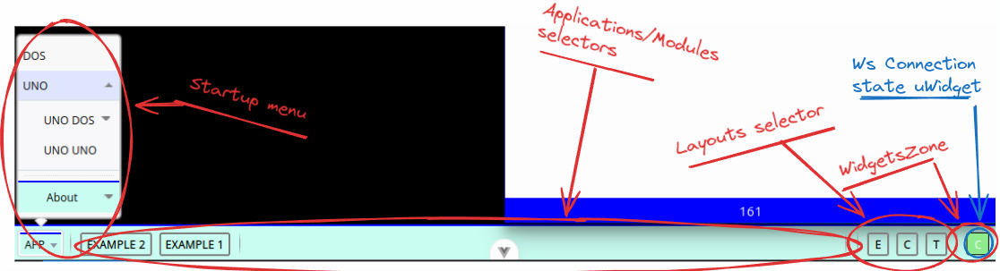
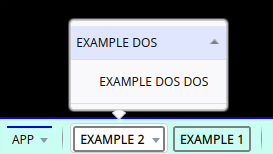

# CTOOLBAR

It is a simple toolbar inspired in anyone of those of the "old" operating systems.

From the scripts added, it the methods can be accessed via:

`window.CAppControll3r.[method](...args)`


## INTRODUCTION



In very simple words, the toolbar contains:

* Kind of a startup button with an "about" selector that will basically show the version of the **coyot3vuapp** (*i like this fun name...*).
* An *applications* like section, where it will be shown a button per module contained in a *winbox* that will be loaded.
* A layouts selector, containing a **C**ascade, **T**iled and any other layouts that are configured in the `config file`.
* A *widgets* zone where it will be possible to include small html based micro-applications. The default widget is just a *green/red* flag to inform about the connection with the websockets server.


## HOW TO USE IT

From the javascript included in each module, the following methods are accessible throw the `window.CAppControll3r`:

  Remember (from the `CappControll3r` section) that, if you create any instance of a class at the `CAppControll3r`, you will be able to access from the instance using `this.controller./method/(...)`
* `add_menu_option`
  
  Adds an option in a specific toolbar selector

  * `text` : The text that will be shown in the selector
  * `id` : the ID of the included button.
  * `callback-on-click` : (optional) : function : Callback function when the option is clicked.
  * `options` : (optional) : object
    * `appSelector`: string : id of the selector, as configured in the `Name` of the config-coyot3 file.
      * It's an optional parameter. If it is not specified, then, the option will be included in the tree of the `APP` button.
    * `index` : (string) : the ID to be searched in the *active tree*.
      * This parameter is optional. If it is not specified, then the option will be pushed at the first level of the option. *Like the case of `UNO` and `DOS` in the image.*


For example, to include at the module titled `EXAMPLE 2` more options we may launch the following commands:

```js
// add a selector titled 'EXAMPLE DOS' with the ID 'example-option', with no callback, to be added at the selector with the ID `example2` (that happens to be the one with the text 'EXAMPLE DOS'). If the selector is not a menu, convert it to a menu.
this.controller.add_menu_option('EXAMPLE DOS','example-option',null,{index : '',appSelector:'example2'})  

// add the selector titled 'EXAMPLE DOS DOS' with the ID 'example-optionN-2', without callback, at the tree of the selector 'example2' (titled 'EXAMPLE 2'), at the submenu of 'example-option' (created in the previous command.). If the selector is not a menu, convert it to a menu.
this.controller.add_menu_option('EXAMPLE DOS DOS','example-optionN-2',null,{index : 'example-option',appSelector:'example2'})  
```


And will produce the following effect:



> *Transforms the selector `EXAMPLE 2` in a menu, and adds the `EXAMPLE DOS` option, with the suboption `EXAMPLE DOS DOS`*


